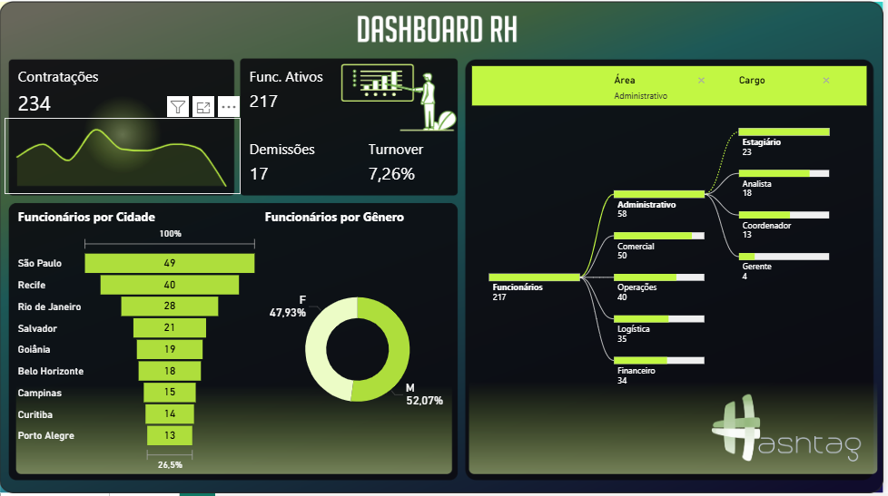
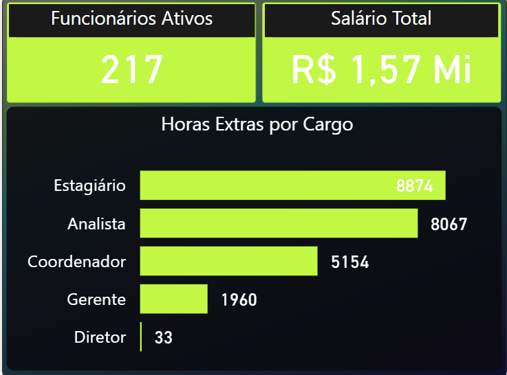

# 📊 Dashboard de RH — Power BI

## 🎯 Objetivo
Desenvolver um painel interativo no **Power BI** para monitorar indicadores de **Recursos Humanos**, incluindo:  
- Contratações  
- Desligamentos  
- Turnover  
- Distribuição de funcionários por área, cargo e cidade  
- Controle de horas extras  

O objetivo é fornecer **insights rápidos e acionáveis** para apoiar decisões estratégicas da área de RH.

---

## 🗂️ Dataset
- **Fonte:** dataset simulado (dados fictícios para fins de estudo).  
- **Tamanho:** ~217 registros.  
- **Campos principais:** Cidade, Cargo, Área, Contratações, Demissões, Status, Gênero, Horas Extras.  

---

## ⚙️ Modelagem de Dados
- **Tabela de Fatos:** Funcionários  
- **Tabelas de Dimensão:** Área, Cargo, Localidade  
- **Relacionamentos:**  
  - Área → Funcionários (1:N)  
  - Cargo → Funcionários (1:N)  
  - Localidade → Funcionários (1:N)  

---

## 📐 Métricas em DAX
Exemplos de medidas criadas no dashboard:

**Turnover (%)**
```DAX
Turnover = DIVIDE([Demissões], [Funcionários Ativos])
```

**% Feminino**
```DAX
% Feminino = DIVIDE([Qtd Mulheres], [Total Funcionários])
```

**Contratações**
```DAX
Contratações = COUNTROWS(FILTER(Funcionários, Funcionários[Status] = "Contratado"))
```

## 📸 Screenshots

### Visão Geral


### Horas Extras


> As imagens foram exportadas do relatório desenvolvido no Power BI Desktop.

---

## 🔎 Insights Obtidos
- **Turnover total:** 7,26%  
- **Cidades com maior concentração de funcionários:** São Paulo e Recife  
- **Áreas mais impactadas por desligamentos:** Operações e Comercial  
- **Cargos com mais horas extras:** Estagiário e Analista  

---

## 🚀 Tecnologias Utilizadas
- Power BI Desktop  
- Linguagem DAX  
- Modelagem Dimensional  

---

## 👩‍💻 Autora
[Fiama Ribeiro](https://github.com/fiamaribeiro)  
Estudante de Gestão de T.I. (Anhanguera) e profissional em transição para a área de Dados & BI.
